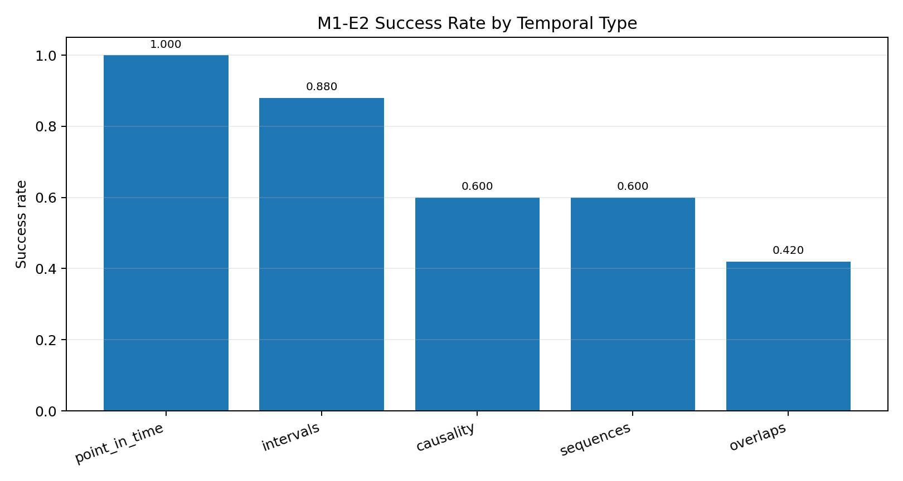
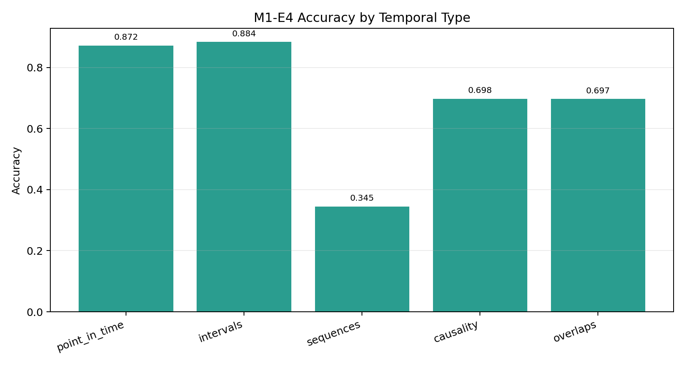
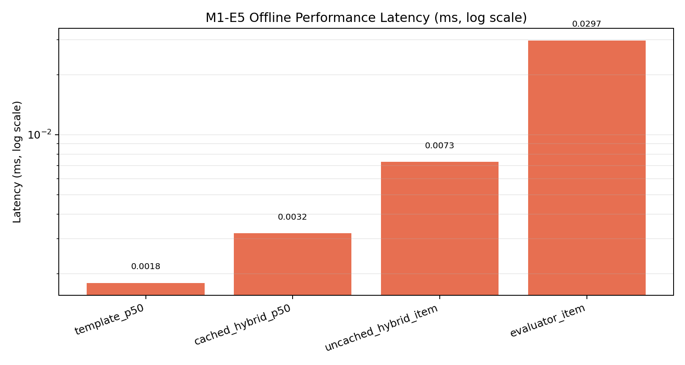

# RESULTS_M1

UUIDs replace the old timestamped result folders. Paths below point to the latest or best M1 artifacts per experiment.

> **Dataset note:** The M1 NLG library (8 temporal templates, TMS, hybrid generator) was designed and validated against the
> 51,232-record temporal knowledge graph corpus built during M3.
> That corpus - not these experiments - is the primary data asset of the project.
> See [RESULTS_M3.md](RESULTS_M3.md#centerpiece-achievement--temporal-knowledge-graph-dataset) for dataset details.

## Run Summary
| Experiment | Description | Artifact | Key metrics |
| --- | --- | --- | --- |
| E1/E2 | NLG quality (gpt-4.1-nano, 50 per type -> 250 renders) | [m1_e1_report.json](output/m1_e2_llm_nlg/results/a73e8fd101164e0a92cf5c4b14a42be9/m1_e1_report.json) | Flesch 58.06; success 0.70 (175/250); per-type success: point_in_time 1.00, intervals 0.88, causality 0.60, sequences 0.60, overlaps 0.42; renders: [m1_e2_renders.json](output/m1_e2_llm_nlg/results/a73e8fd101164e0a92cf5c4b14a42be9/m1_e2_renders.json) |
| E3 | Hybrid generator smoke (gpt-4.1-nano, examples_per_type=100) | [m1_e3_report.json](output/m1_e3_hybrid/results/e677955289b64126a20fa21abf69b350/m1_e3_report.json) | accuracy 1.00; success 1.00; Flesch 78.20 +/- 14.37; hallucination 0.00; template_hit_rate 0.74; polishing_rate 0.26; full type coverage |
| E4 | Accuracy eval on hybrid outputs | [m1_e4_report.json](output/m1_e4_accuracy/results/73b7dd703b474b44a8f69d4227a4115c/m1_e4_report.json) | overall_accuracy 0.699; entity_f1 0.559; hallucination_rate 0.34; per-type accuracy: point_in_time 0.872, intervals 0.884, sequences 0.345, causality 0.698, overlaps 0.697; details: [accuracy_details.csv](output/m1_e4_accuracy/results/73b7dd703b474b44a8f69d4227a4115c/accuracy_details.csv) |
| E5 (integration) | Offline integration suite | [integration_test_results.json](output/m1_e5_integration/results/963c60095c28452f94700757d40550e8/integration_test_results.json) | 19/19 passing |
| E5 (perf) | Offline performance benchmarks | [performance_benchmarks.json](output/m1_e5_integration/results/59857284b354488087b495ebb4960780/performance_benchmarks.json) | template p50 0.0018 ms; cached hybrid p50 0.0032 ms; uncached hybrid 0.0073 ms/item (batch=50); evaluator batch 0.0297 ms/item |

## How to Reproduce
1) NLG eval (E2): `python experiments/m1_e2_llm_nlg/run_eval.py --model gpt-4.1-nano --examples 50`
2) Hybrid generation (E3): `python experiments/m1_e3_hybrid/run_hybrid_generator.py --model gpt-4.1-nano --examples-per-type 100`
3) Accuracy eval (E4): `python experiments/m1_e4_accuracy/run_accuracy_eval.py --source output/m1_e3_hybrid/results --output-dir output/m1_e4_accuracy/results`
4) Integration tests (E5): `python experiments/m1_e5_integration/integration_tests.py`
5) Performance benchmarks (E5): `python experiments/m1_e5_integration/performance_benchmarks.py`

Primary M1 result copies are centralized under `output/m1_*/results/<uuid>/`.

## Metrics Coverage
- E1/E2: readability (Flesch), success/coverage by temporal type, per-render details.
- E3: latency percentiles, accuracy proxy, template hit rate, polishing rate, hallucination rate, per-type coverage.
- E4: overall and per-type accuracy, entity/date/relation preservation, hallucination, template vs polished gap, per-example CSV.
- E5: pipeline integration (template + LLM strategy, caching, evaluation), and micro-benchmarks (template, cached/uncached hybrid, evaluator batch).

## Charts

### M1-E2 Success by Temporal Type

### M1-E4 Accuracy by Temporal Type

### M1-E5 Latency Benchmarks (Offline)

## Final M1 Conclusions
- M1 establishes a reliable temporal NLG base with complete integration test pass rate (19/19) and strong hybrid-generator stability.
- Template-heavy types (point-in-time, intervals) are strongest, while sequence/overlap explanation quality remains the main improvement area for later milestones.
- Offline runtime costs are very low (sub-millisecond per component), making the M1 stack suitable as a fast baseline layer for M2/M3 pipelines.

## Gaps
- No online LLM latency/throughput (offline-safe mode).
- Human evaluation still pending (see docs/HUMAN_EVAL.md).
- Model training metrics (beyond LoRA notes below) remain out of scope here.

## LoRA NLG (Phi-4-mini) status
- GPU QLoRA run: TrainOutput(global_step=50, training_loss=1.78, train_runtime~38.7m, steps/s~0.022).
- Artifacts: adapter at models/temporal_nlg_lora/, optional merged weights at models/temporal_nlg_merged/.
- Smoke test: `python examples/milestone1/m1e2_lora_inference_example.py --instruction "Generate a temporal explanation" --input-text "entity: Apollo 11; event: moon landing; date: 1969-07-20; context: NASA mission" --adapter-path models/temporal_nlg_lora --no-4bit --max-new-tokens 64`.
- Evaluation command: `python experiments/m1_e2_llm_nlg/run_eval.py --model gpt-4.1-nano --examples 50`.
- Dataset: custom 38k+ temporal NLG rows (instruction/input/output) built for M1 training/eval.

## Summary
M1 establishes the baseline temporal NLG stack for the project: template rendering, LLM-based generation, hybrid routing, accuracy evaluation, and offline integration all landed with stable artifacts and clear metrics.

The remaining gaps are also explicit. Sequence and overlap quality still trail the simpler temporal forms, and human evaluation remains pending, which makes M1 a clean baseline for the later M2 and M3 work rather than a terminal result.

