# RESULTS_M3

This page summarizes Milestone 3 experiments and points to the saved evaluation artifacts.

---

## Centerpiece Achievement - Temporal Knowledge Graph Dataset

> **51,232 human-curated temporal graph records across 35+ domains** -
> the largest purpose-built temporal reasoning dataset produced in this project,
> and the foundation for every M3 evaluation.

### Dataset at a Glance

| Attribute | Value |
| --- | --- |
| File | `data/jsonls/temporal_graph.jsonl` (~65 MB) |
| Records | **51,232** |
| Domains | **35+** |
| Curation | Human-reviewed; structured as temporal knowledge graph triples |
| Precomputed graph | `data/jsonls/temporal_graph_output_v3/` (nodes.jsonl + edges.jsonl) |
| Embedding index | `data/jsonls/embeddings_4b/` (Qwen3-Embedding-4B, 4096-dim vectors) |

### Domain Distribution (top 10)

| Domain | Records |
| --- | ---: |
| Historical | 11,408 |
| Financial | 9,479 |
| Technical | 6,888 |
| Geopolitical | 5,533 |
| Cultural | 5,081 |
| Science | 4,060 |
| Medical | 3,663 |
| Environmental | 3,107 |
| Sports | 2,601 |
| Political | 2,512 |
| All other domains | 4,900 |

### Evaluation Set

| Attribute | Value |
| --- | --- |
| File | `data/jsonls/temporal_evaluation_set_v2.jsonl` |
| Questions | **295 curated QA pairs** |
| Difficulty | Easy 108 - Medium 125 - Hard 62 |
| Domain coverage | Economics 85 - Politics 37 - Sports 33 - Entertainment 33 - Technology 32 - Temporal reasoning 30 - History 19 - Others |

### Why This Matters

The dataset is not a by-product - it *is* the core infrastructure that makes every downstream M3 experiment possible:

- **M3-E1** (domain coverage) - directly sampled from the 51,232 records to verify the required 4 major domains.
- **M3-E2** (fidelity) - 100-item stratified samples per explanation type drawn from the same corpus.
- **M3-E3** (comprehension) - 50 export tasks built from corpus facts with human-collected responses.
- **M3-E4** (quality: efficiency, consistency, coherence, granularity) - all 1,000-fact runs sourced from the corpus.
- **M3-E5** (QA benchmark) - finalized matrix with 25 configurations (15 Qwen project runs + 10 OpenAI LCEL comparisons) and aggregate `MATRIX.json`.

The graph was constructed with a domain-guided sampling strategy to ensure factual diversity, temporal specificity, and structural balance (point-in-time, interval, sequence, causal relation types). The precomputed embeddings enable semantic graph retrieval without re-embedding at query time.

---

## Milestone 3 - M3-E2 Fidelity Metrics (Temporal Explanations)

### Dataset
- Source: `data/jsonls/temporal_graph.jsonl`
- Sampling (per run below):
  - Point-in-time: `--point-per-domain 20 --max-domains 5` (100 total point examples)
  - Interval / Sequence / Causal: `--n-per-type 100`
  - Seed: `13`

### What is being measured
M3-E2 reports two categories of metrics:
- **Automatic / proxy metrics** computed heuristically from the text (e.g., timestamp accuracy, boundary accuracy, ordering accuracy, context relevance proxies).
- **Judgement metrics** (ambiguity resolution, causal link accuracy, confidence calibration, narrative consistency):
  - Either left `null` (no human loop)
  - Or filled via **LLM-in-the-loop** scoring (`--human-loop llm`) as a scalable proxy.

Important: LLM judgement metrics are **not** equivalent to a human study or expert review.

### Run artifacts
Each run writes:
- `m3_e2_fidelity.per_item.jsonl` (per example metrics)
- `m3_e2_fidelity.summary.json` (aggregates by bucket)
- If `--human-loop llm`: `m3_e2_fidelity.human_loop_llm.jsonl` (per example judgement metrics + notes)

### Baseline (no LLM; uses `gold_answer` as prediction)
- Output folder: `output/m3_e2_fidelity_full100/`
- Summary: `output/m3_e2_fidelity_full100/m3_e2_fidelity.summary.json`

Key proxy metrics (averaged by bucket):
- Point: timestamp_accuracy 0.975; entity_coverage 0.802; context_relevance 0.703
- Interval: boundary_accuracy 0.29; duration_correctness 0.30; interval_marker_presence 0.77
- Sequence: ordering_accuracy 0.588; step_completeness 0.825; sequence_marker_presence 0.23
- Causal: temporal_constraint_correctness 0.955; causal_marker_presence 0.36; entity_coverage 0.387

### LLM judgement runs (LLM-in-the-loop proxy)
All runs below still used the dataset `gold_answer` as the prediction baseline (no `--predictions`).

| Judge model | Output folder | llm_scored | Notes |
| --- | --- | ---: | --- |
| gpt-4.1-nano | `output/m3_e2_fidelity_llm100/` | 400 | Earlier run; summary does not include the `llm` config block. |
| gpt-4o | `output/m3_e2_fidelity_llm100_gpt-4o/` | 400 | Includes `llm` config block in summary. |
| gpt-5.1 | `output/m3_e2_fidelity_llm100_gpt-5_1/` | 400 | Includes `llm` config block in summary. |
| gpt-5.2 | `output/m3_e2_fidelity_llm100_gpt-5_2/` | 400 | Includes `llm` config block in summary. |
| gpt-5-nano | `output/m3_e2_fidelity_llm100_gpt-5-nano/` | 0 | No judgement rows produced (likely model-name/access issue). |

#### LLM judgement metrics (mean over bucket)

Below are the 4 judgement metrics as recorded in each run's `m3_e2_fidelity.summary.json`.

**gpt-4.1-nano** (`output/m3_e2_fidelity_llm100/m3_e2_fidelity.summary.json`)
- Point: ambiguity_resolution 1.000; causal_link_accuracy 1.000; confidence_calibration 0.982; narrative_consistency 1.000
- Interval: ambiguity_resolution 0.991; causal_link_accuracy 1.000; confidence_calibration 0.931; narrative_consistency 0.999
- Sequence: ambiguity_resolution 0.988; causal_link_accuracy 0.981; confidence_calibration 0.967; narrative_consistency 0.998
- Causal: ambiguity_resolution 0.965; causal_link_accuracy 0.970; confidence_calibration 0.846; narrative_consistency 0.994

**gpt-4o** (`output/m3_e2_fidelity_llm100_gpt-4o/m3_e2_fidelity.summary.json`)
- Point: ambiguity_resolution 0.991; causal_link_accuracy 1.000; confidence_calibration 0.991; narrative_consistency 1.000
- Interval: ambiguity_resolution 0.996; causal_link_accuracy 0.750; confidence_calibration 0.994; narrative_consistency 0.999
- Sequence: ambiguity_resolution 0.983; causal_link_accuracy 0.820; confidence_calibration 0.981; narrative_consistency 0.998
- Causal: ambiguity_resolution 0.940; causal_link_accuracy 0.984; confidence_calibration 0.955; narrative_consistency 0.994

**gpt-5.1** (`output/m3_e2_fidelity_llm100_gpt-5_1/m3_e2_fidelity.summary.json`)
- Point: ambiguity_resolution 0.999; causal_link_accuracy 0.480; confidence_calibration 0.980; narrative_consistency 0.999
- Interval: ambiguity_resolution 0.990; causal_link_accuracy 0.271; confidence_calibration 0.989; narrative_consistency 0.999
- Sequence: ambiguity_resolution 0.972; causal_link_accuracy 0.668; confidence_calibration 0.942; narrative_consistency 0.983
- Causal: ambiguity_resolution 0.918; causal_link_accuracy 0.942; confidence_calibration 0.899; narrative_consistency 0.991

**gpt-5.2** (`output/m3_e2_fidelity_llm100_gpt-5_2/m3_e2_fidelity.summary.json`)
- Point: ambiguity_resolution 0.998; causal_link_accuracy 0.150; confidence_calibration 0.978; narrative_consistency 1.000
- Interval: ambiguity_resolution 0.970; causal_link_accuracy 0.244; confidence_calibration 0.952; narrative_consistency 0.983
- Sequence: ambiguity_resolution 0.966; causal_link_accuracy 0.473; confidence_calibration 0.952; narrative_consistency 0.987
- Causal: ambiguity_resolution 0.979; causal_link_accuracy 0.923; confidence_calibration 0.923; narrative_consistency 0.900

### Takeaways

- The proxy metrics look strong for **point** timestamping (timestamp_accuracy 0.975) and **causal** temporal constraints (temporal_constraint_correctness 0.955), but much weaker for **interval boundary/duration correctness** (boundary_accuracy ~0.29; duration_correctness ~0.30 in the baseline run).
- Sequence explanations tend to cover steps (step_completeness ~0.83) but are less explicit about ordering/structure (ordering_accuracy ~0.59; sequence_marker_presence ~0.23).
- LLM judgement metrics are generally high on ambiguity resolution and narrative consistency, but the **causal_link_accuracy judgement is highly model-sensitive** in this setup (notably lower for gpt-5.1/gpt-5.2 on point/interval buckets).
- `gpt-5-nano` produced no judgement rows (`llm_scored: 0`), suggesting the model name/access is not available for the current API key/account, or requests failed during structured output.

### M3-E2 Charts

Chart images for M3-E2 are stored in `docs/images/m3/`.

#### Proxy Metrics by Bucket

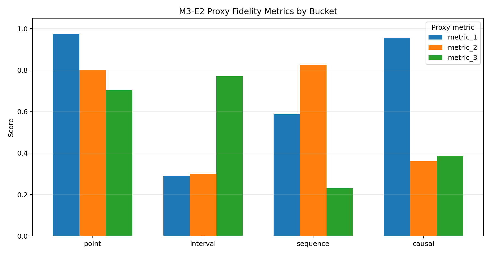

#### LLM Judge Sensitivity (Causal Link Accuracy)

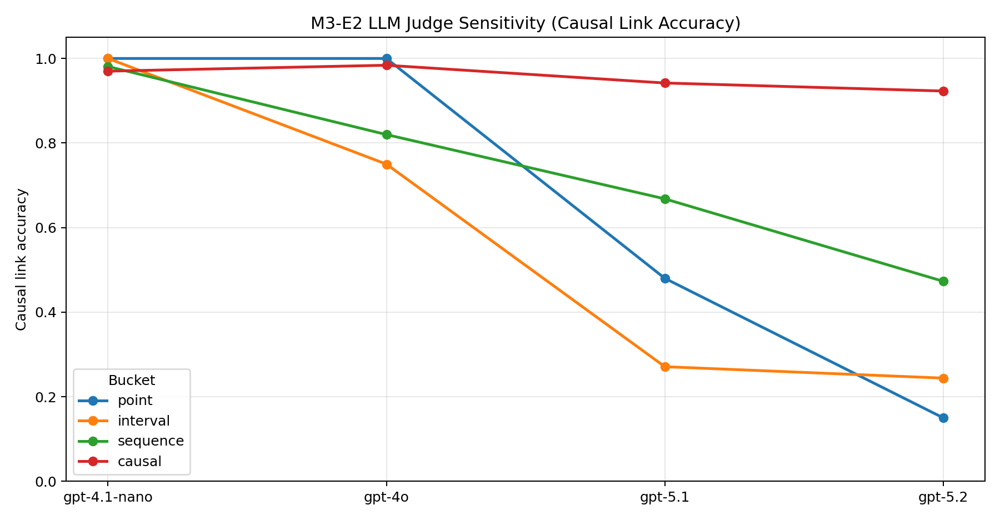

Next steps:
- Re-run on actual system outputs by passing `--predictions ...`.
- For publishable results, run a real human/expert annotation pass (export tasks with `--human-loop human`) and treat LLM judgement as a proxy-only ablation.

### How to reproduce
Baseline (no predictions file; uses `gold_answer`):

```bash
python experiments/m3_e2_fidelity/run_fidelity_eval.py \
  --dataset data/jsonls/temporal_graph.jsonl \
  --output-dir output/m3_e2_fidelity_full100 \
  --n-per-type 100 \
  --point-per-domain 20 \
  --max-domains 5 \
  --seed 13
```

LLM judgement mode:

```bash
python experiments/m3_e2_fidelity/run_fidelity_eval.py \
  --dataset data/jsonls/temporal_graph.jsonl \
  --output-dir output/m3_e2_fidelity_llm100_gpt-4o \
  --n-per-type 100 \
  --point-per-domain 20 \
  --max-domains 5 \
  --seed 13 \
  --human-loop llm \
  --llm-model gpt-4o \
  --llm-temperature 0 \
  --llm-max-tokens 200
```

Notes:
- The runner best-effort loads `.env` from the repo root so `OPENAI_API_KEY` can be provided via `.env`.
- To evaluate real model outputs, pass `--predictions path/to/preds.jsonl` with `{id, prediction}` (or `generated_text|output|text`).

## Milestone 3 - M3-E4 Efficiency, Coherence, and Granularity

### Data reuse
- Source: `data/jsonls/temporal_graph.jsonl`
- M3-E4 exports reuse the same dataset (no additional preprocessing).

### M3-E4a Efficiency (proxy quality + latency)
- Output folder: `output/m3_e4a_efficiency_analysis_methods/`
- Summary: `output/m3_e4a_efficiency_analysis_methods/m3_e4a_efficiency.summary.json`

Key aggregates (means):
- Template: latency 0.000538 ms; tokens_out 9.318; quality_proxy 0.5029
- Hybrid: latency 0.076005 ms; tokens_out 15.318; quality_proxy 0.5029
- Baseline: latency 0.000829 ms; tokens_out 16.284; quality_proxy 0.4435
- LLM variants (gpt-5-nano/gpt-4.1-nano/gpt-4o/o4-mini/gpt-5.1/gpt-5.2): latency 0.0055-0.0101 ms; tokens_out 16.45; quality_proxy 0.6292

### M3-E4c Coherence (auto scoring)
- Output folder: `output/m3_e4c_coherence_analysis_auto/`
- Summary: `output/m3_e4c_coherence_analysis_auto/m3_e4c_coherence.summary.json`

Overall (auto):
- semantic_consistency_mean 0.6711
- narrative_consistency_mean 0.5402
- logical_consistency_mean 0.9530

By style (semantic consistency mean):
- template 0.7392; seq2seq 0.7269; hybrid 0.7152; baseline 0.6252; llm 0.5491

Note: The current summary was generated with sentence-transformers embeddings; the analyzer reports by_style coherence for the exported styles list.

### M3-E4d Granularity (proxy quality by time scale)
- Output folder: `output/m3_e4d_granularity_analysis_methods/`
- Summary: `output/m3_e4d_granularity_analysis_methods/m3_e4d_granularity.summary.json`

Key proxy quality means:
- Decades: 0.5421 (highest among tested scales)
- Days / Hours / Minutes / Months / Seconds / Years: 0.4985 (flat band across these granularities)

### Takeaways
- Template and hybrid methods show similar proxy quality in M3-E4a, with hybrid incurring higher latency.
- Coherence auto-scores suggest moderate semantic overlap and strong logical consistency across styles.
- Granularity proxy quality is mostly stable across scales, with a small lift at the decades level.

### M3-E4 Charts

Chart images for M3-E4 are stored in `docs/images/m3/`.

#### M3-E4a Quality Proxy vs Latency by Method

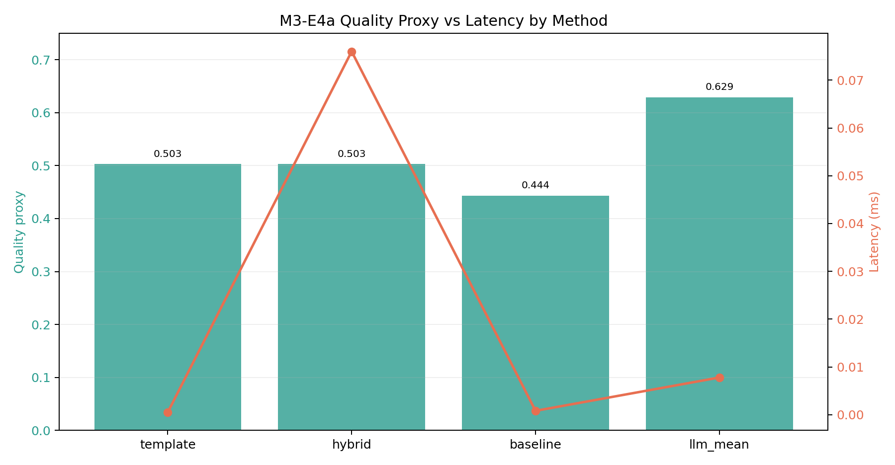

#### M3-E4c Coherence Summary

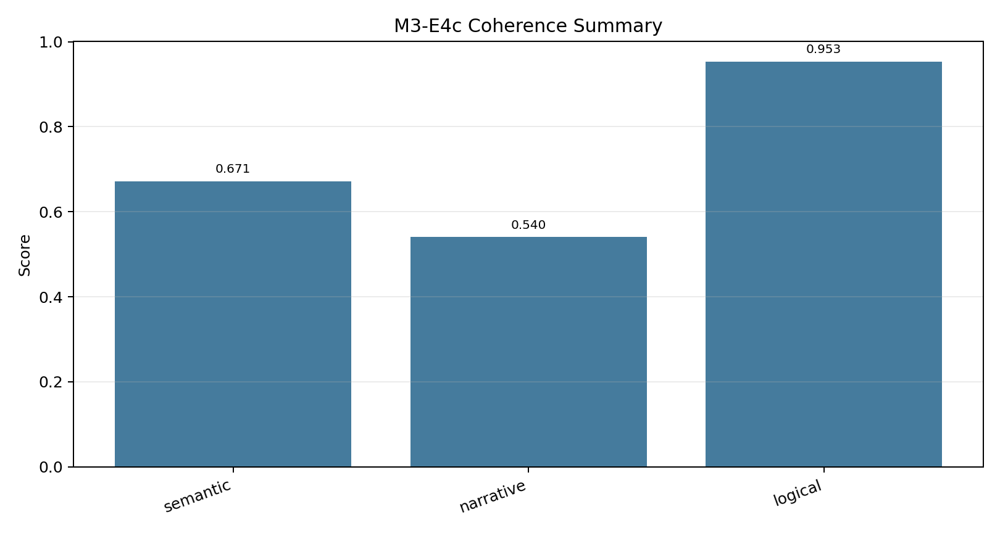

#### M3-E4d Proxy Quality by Granularity

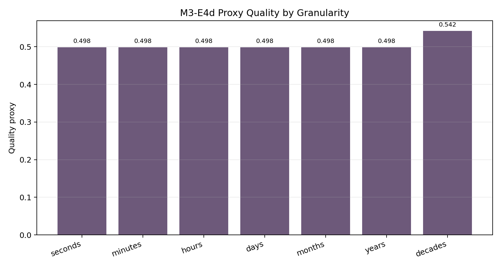

## Milestone 3 - M3-E5 End-to-End QA Benchmark (Finalized Matrix)

### Run artifacts
- Run outputs: `output/m3_e5_results/<run_id>/`
- Aggregated matrix: `output/m3_e5_results/MATRIX.json`
- Archived duplicate bundles were moved outside active repo paths.

### Benchmark Coverage
- Total completed configurations in the final matrix: 25.
- Project Qwen matrix: 15 runs (`llm_0.8b`, `llm_2b`, `llm_4b` x 5 modes).
- OpenAI LCEL comparison runs: 10 runs (`gpt-4.1-nano`, `gpt-4o`, `gpt-5-nano`, `gpt-5-mini`, `gpt-5.1`, `gpt-5.2`, `gpt-5.4`, `gpt-5.4-mini`, `gpt-5.4-nano`, `o4-mini`).
- All listed runs use `data/jsonls/temporal_evaluation_set_v2.jsonl` with 295 questions.

### Conclusions (project solution)
- Graph retrieval remains the strongest strategy for each tested Qwen size (0.8B, 2B, 4B) on exact match.
- Best graph gain over best non-graph baseline is consistent:
  - 0.8B: `0.5593 - 0.2475 = +0.3119`
  - 2B: `0.6000 - 0.3593 = +0.2407`
  - 4B: `0.7424 - 0.6915 = +0.0508`
- Mean exact by mode over Qwen sizes confirms ranking:
  - `graph_small_emb`: 0.6339
  - `graph_large_emb`: 0.6316
  - `rag_large_emb`: 0.4328
  - `pure_llm`: 0.2768
  - `rag_small_emb`: 0.2757
- Latency remains favorable for graph modes compared with RAG in this matrix.

### Qwen Project Matrix (Exact)

| model | pure_llm | rag_small_emb | rag_large_emb | graph_small_emb | graph_large_emb | best_mode |
| --- | ---: | ---: | ---: | ---: | ---: | --- |
| llm_0.8b | 0.0610 | 0.1356 | 0.2475 | 0.5593 | 0.5559 | graph_small_emb |
| llm_2b | 0.3288 | 0.2542 | 0.3593 | 0.6000 | 0.6000 | graph_small_emb / graph_large_emb |
| llm_4b | 0.4407 | 0.4373 | 0.6915 | 0.7424 | 0.7390 | graph_small_emb |

### OpenAI LCEL Results (Exact)

| model | exact | contains | latency_sec_mean |
| --- | ---: | ---: | ---: |
| gpt-5.2 | 0.8949 | 0.9390 | 0.754 |
| gpt-5.1 | 0.8814 | 0.9220 | 1.067 |
| gpt-4o | 0.8712 | 0.8881 | 1.032 |
| gpt-5.4 | 0.8644 | 0.8949 | 0.819 |
| o4-mini | 0.8068 | 0.8068 | 2.908 |
| gpt-5.4-mini | 0.8034 | 0.8102 | 0.623 |
| gpt-5.4-nano | 0.7695 | 0.7864 | 0.917 |
| gpt-4.1-nano | 0.6915 | 0.6915 | 0.658 |
| gpt-5-mini | 0.6814 | 0.6847 | 7.283 |
| gpt-5-nano | 0.5831 | 0.5831 | 4.371 |

### Suggested Solution vs Latest GPT Models

Suggested project solution: `llm_4b__graph_small_emb__emb_0.6b` with exact `0.7424`.

| model | M3-E5 exact | gap vs project solution (`model - 0.7424`) |
| --- | ---: | ---: |
| gpt-5.2 | 0.8949 | +0.1525 |
| gpt-5.1 | 0.8814 | +0.1390 |
| gpt-4o | 0.8712 | +0.1288 |
| gpt-5.4 | 0.8644 | +0.1220 |
| o4-mini | 0.8068 | +0.0644 |
| gpt-5.4-mini | 0.8034 | +0.0610 |
| gpt-5.4-nano | 0.7695 | +0.0271 |
| gpt-4.1-nano | 0.6915 | -0.0508 |
| gpt-5-mini | 0.6814 | -0.0610 |
| gpt-5-nano | 0.5831 | -0.1593 |

Interpretation: graph retrieval closes a substantial portion of the quality gap to top GPT variants while using far smaller open-weight model sizes (0.8B to 4B in this matrix), and already exceeds several small GPT variants in exact-match.

### External Size Estimates (from https://arxiv.org/html/2604.24827v1)

These are approximate model-size estimates provided for contextual comparison.

| model | reference score (paper) | estimated size | M3-E5 exact |
| --- | ---: | ---: | ---: |
| GPT-4o | 55.3% | ~720B | 0.8712 |
| GPT-5 Mini | 51.7% | ~410B | 0.6814 |
| GPT-5 Nano | 40.5% | ~71B | 0.5831 |
| GPT-5.4 | 57.7% | ~1.0T | 0.8644 |
| GPT-5.1 | 59.3% | ~1.3T | 0.8814 |
| GPT-5.2 | 58.9% | ~1.3T | 0.8949 |
| GPT-4.1 | 62.3% | ~2.2T | 0.6915 (gpt-4.1-nano run) |

### M3-E5 Charts

Chart images for M3-E5 are stored in `docs/images/m3/`.

#### Mean Exact by Mode (Qwen matrix)

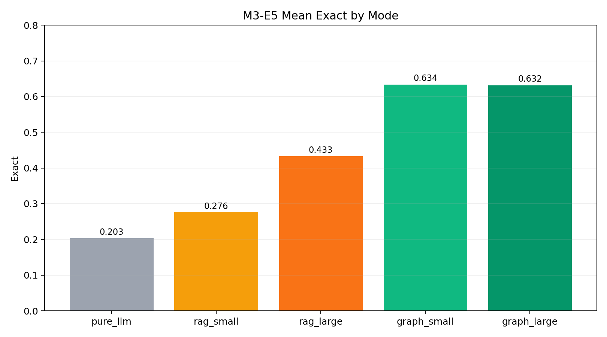

#### Mean Latency by Mode (Qwen matrix)

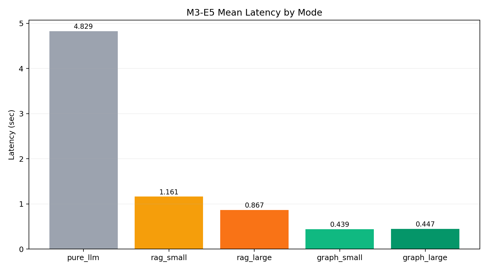

#### Best Graph Gain vs Best Non-Graph per Qwen Model

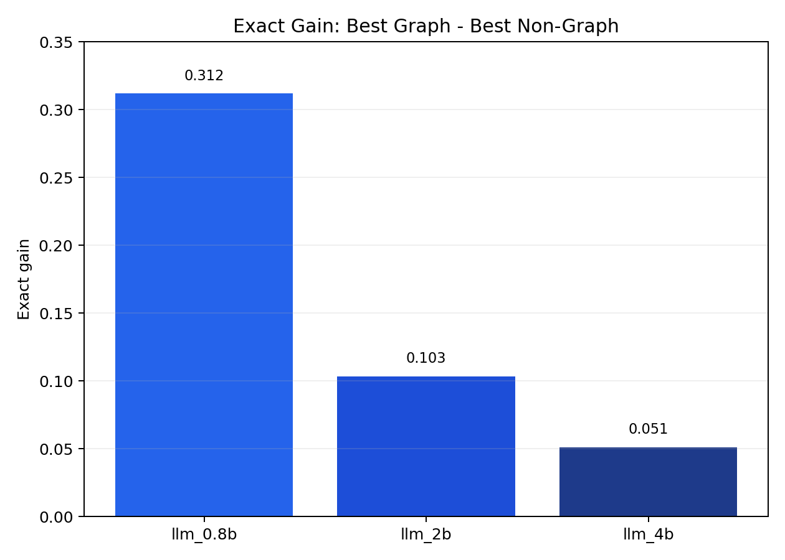

#### Exact by Mode and Qwen Model Size

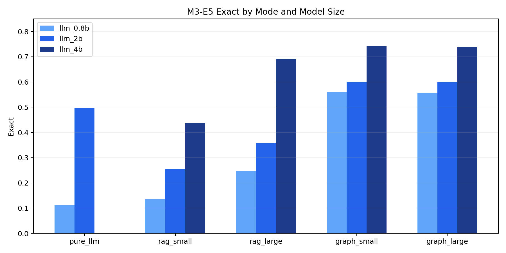

#### All Models: Project Graph vs OpenAI

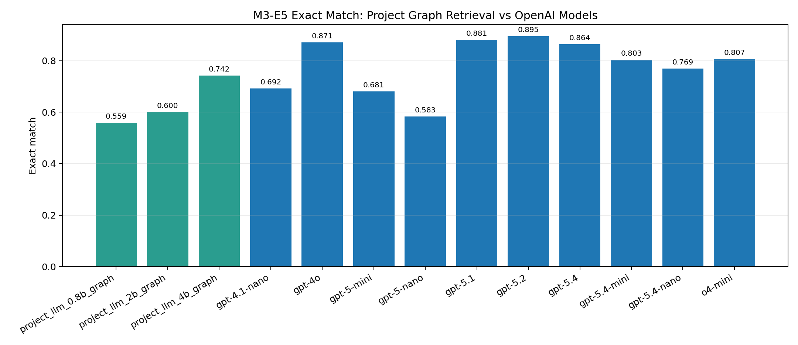

#### Suggested Project Solution vs Latest GPT Models

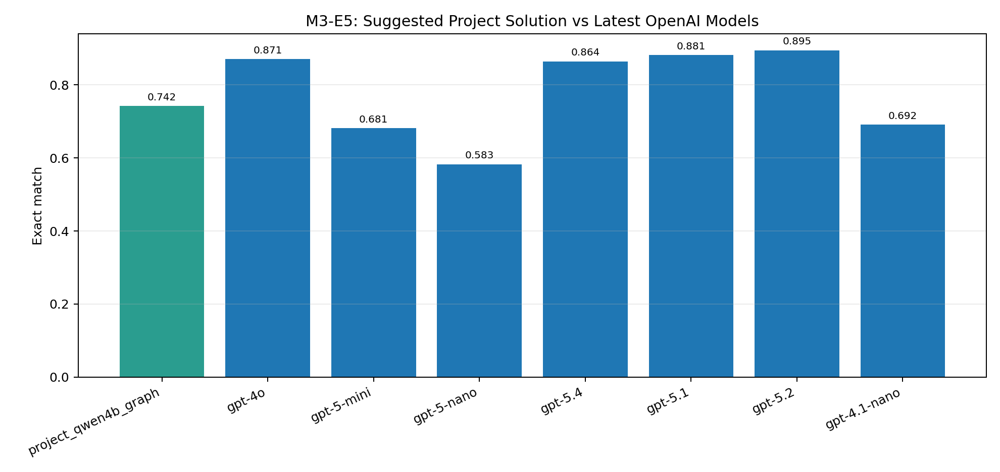

#### Exact vs Estimated Model Size (log scale)

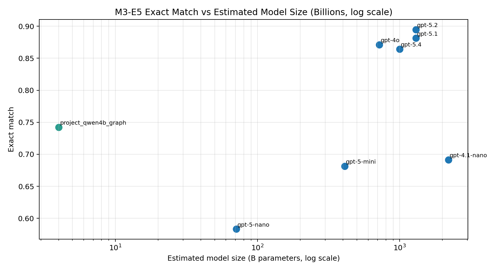

### Notes
- The pure-Qwen folders are restored under `output/m3_e5_results/llm_*__pure_llm` and included in the final aggregate matrix.
- Duplicate pure folders were removed from tracked artifacts to keep the repository output set clean.

## Milestone 3 - Temporal Graph Query Stack (LCEL + Built-in Visualization)

### Scope
- Added an operational graph-query layer over `data/jsonls/temporal_graph_output` to support direct temporal reasoning questions:
  - "what was the reason of X in YYYY?"
  - "If A happened to B in YYYY, will same happen to C?"
  - "When did A start affecting B?"

### Components
- `src/temporal_nlg/graph_query/index.py`: loads `nodes.jsonl` and `edges.jsonl`, builds label and adjacency indexes.
- `src/temporal_nlg/graph_query/retrieval.py`: deterministic retrieval functions for reason, analogical transfer, and start-affecting queries.
- `src/temporal_nlg/graph_query/lcel.py`: LangChain LCEL pipeline (`RunnableLambda`) with optional LLM post-processing.
- `src/temporal_nlg/graph_query/visualization.py`: built-in Mermaid subgraph generator (no external graph database).

### Runnable demo
- `examples/milestone3/m3e1_dataset_overview_example.py`
- `examples/milestone3/m3e2_fidelity_summary_example.py`
- `examples/milestone3/m3e3_human_eval_overview_example.py`
- `examples/milestone3/m3e4_quality_summary_example.py`
- `examples/milestone3/m3e5_matrix_overview_example.py`
- `examples/milestone3/m3e5_lcel_query_example.py`
- Writes outputs to `output/examples/milestone3/` including answer payloads and Mermaid-ready graph snippets.
- All examples use `src/temporal_nlg` package modules.

### Validation
- Unit tests added at `tests/test_temporal_graph_query.py` for all three supported query families and LCEL invocation path.

## Summary
M3 centers on the temporal graph corpus, the benchmark evaluation set, and the retrieval-driven QA matrix. The results show that graph-grounded retrieval is the strongest strategy across the tested Qwen sizes, while the open-model LCEL comparisons provide a useful external reference point.

The milestone also closes the loop on implementation by pairing the graph artifacts with a direct query layer, a fidelity study, and the E5 benchmark matrix. That makes M3 the project’s integration milestone rather than just a dataset release.

